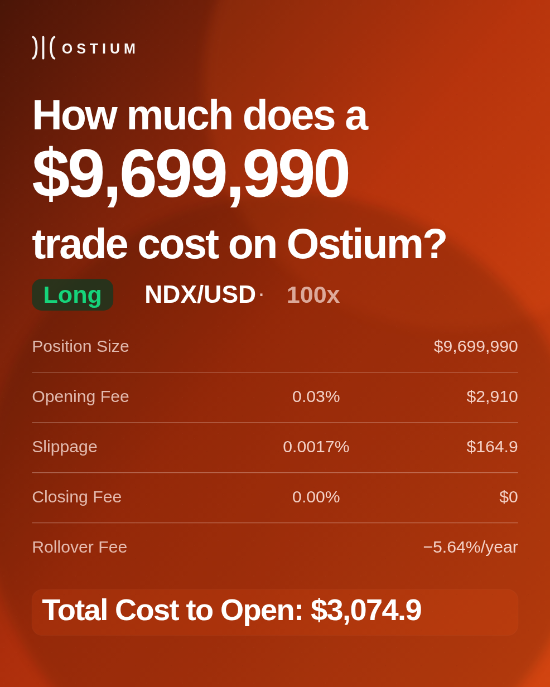

# Ostium Brand Synthesis Workflow

Evidence-backed brand research workflow for turning official Ostium source material into a structured `brand.md` creative spec that AI agents can use for downstream asset generation.

The core deliverable is the source-to-`brand.md` workflow: source intake, authority ranking, visual and voice extraction, and a canonical brand operating spec. Ostium is the worked example.

The repo also includes two ways to use that spec: a deterministic SVG/PNG generator, and a Higgsfield MCP track for image/video experiments.

## What this repo proves

Most AI creative workflows fail at the brand layer: they ask a model to make something “on brand” without giving it a reliable, auditable definition of the brand.

This repo shows a repeatable alternative:

1. collect only provided or approved references,
2. rank sources by authority,
3. separate explicit rules from observed patterns,
4. attach evidence and confidence to every major rule,
5. preserve open decisions instead of inventing precision,
6. produce a `brand.md` that future agents can inspect, cite, challenge, and use.

Short version: brand specs with citations and confidence levels, so downstream AI tools know what they can trust and what they need to route for review.

## Primary artifacts

| Artifact | Purpose |
|---|---|
| [`WORKFLOW.md`](WORKFLOW.md) | Human-readable narrative of the method and why it exists |
| [`docs/brand-md-workflow/`](docs/brand-md-workflow/) | Reusable workflow package for generating a new `brand.md` |
| [`brands/ostium/CASE_STUDY.md`](brands/ostium/CASE_STUDY.md) | Guided tour of the Ostium source-to-spec build |
| [`brands/ostium/brand.md`](brands/ostium/brand.md) | Canonical structured Ostium brand spec within this repo |
| [`brands/ostium/source-inventory.md`](brands/ostium/source-inventory.md) | Source map, authority hierarchy, and local artifact index |
| [`docs/BRAND_PROVENANCE.md`](docs/BRAND_PROVENANCE.md) | How the Ostium spec was derived and what remains provisional |
| [`docs/EVIDENCE_TRACEABILITY_MATRIX.md`](docs/EVIDENCE_TRACEABILITY_MATRIX.md) | Examples of final rules mapped back to evidence sources |
| [`docs/PORTABILITY_TEST.md`](docs/PORTABILITY_TEST.md) | Generator-independent test of whether `brand.md` can guide an unsupported asset type |
| [`docs/future-integrations/`](docs/future-integrations/) | Visual/video portability specs, Higgsfield MCP operating loops, and richer brand-fidelity evaluation |
| [`docs/HIGGSFIELD_MCP_CASE_STUDY.md`](docs/HIGGSFIELD_MCP_CASE_STUDY.md) | Worked example of Higgsfield MCP iteration from first pass to improved rerun |
| [`experiments/higgsfield-mcp-visual-video-portability/`](experiments/higgsfield-mcp-visual-video-portability/) | Review packets and comparison artifacts from Higgsfield MCP tests |
| [`scripts/brand_svg_asset.py`](scripts/brand_svg_asset.py) | Prototype deterministic SVG/PNG consumer of `brand.md` |

## The brand.md synthesis method

The reusable method lives in `docs/brand-md-workflow/`:

1. [`workflow.md`](docs/brand-md-workflow/workflow.md) — end-to-end source-to-`brand.md` process and quality bar.
2. [`intake-checklist.md`](docs/brand-md-workflow/intake-checklist.md) — how to collect, label, and rank reference assets.
3. [`analysis-prompts.md`](docs/brand-md-workflow/analysis-prompts.md) — prompts for PDF/image/video/URL analysis.
4. [`template.md`](docs/brand-md-workflow/template.md) — strict evidence-backed `brand.md` creative spec template.
5. [`build-summary.md`](docs/brand-md-workflow/build-summary.md) — summary of the workflow package and intended handoff.

Workflow stages:

| Stage | Input | Output |
|---|---|---|
| Intake | Brand guides, URLs, docs, videos, screenshots, social posts | Source inventory |
| Authority ranking | All collected sources | Source hierarchy and conflict rules |
| Explicit extraction | Brand guides, docs, PDFs | Stated rules |
| Observational analysis | Images, product UI, social frames, motion | Inferred visual/motion patterns |
| Voice analysis | Social posts, website copy, launch materials | Copy rules and avoid-list |
| Synthesis | All evidence | Confidence-rated creative rules |
| Spec writing | Synthesis | `brand.md` |
| Review | Human correction | Canonical or revised spec |

## Ostium case study

The Ostium first pass uses current official public sources:

- official website and owned visual assets,
- official documentation,
- public app/product surfaces,
- verified official X/Twitter posts and media,
- representative contact sheets and source exports.

Before synthesis, the source material existed across website pages, docs exports, app UI surfaces, X posts, images, videos, and media-kit references.

After synthesis, the workflow produced:

- a structured source inventory,
- authority hierarchy,
- confidence-rated color, type, layout, voice, and logo rules,
- open decisions,
- generation constraints,
- negative prompts / avoid-list,
- a reusable `brand.md`.

Start with [`brands/ostium/CASE_STUDY.md`](brands/ostium/CASE_STUDY.md) for the guided tour.

## Prototype downstream use: deterministic SVG asset generation



The generator is not the main deliverable. It is a downstream proof that a completed `brand.md` can constrain an agent or script enough to produce repeatable, directionally on-brand assets. It supports Ostium-native social templates rather than a single generic abstract brand poster.

### Quick start

```bash
python3 scripts/brand_svg_asset.py \
  --brand-dir ./brands/ostium \
  --template cost-breakdown \
  --position-size '$9,699,990' \
  --market NDX/USD \
  --direction Long \
  --leverage 100x \
  --total-cost '$3,074.9' \
  --out ./outputs/ostium-cost-breakdown-v5.png
```

The command writes:

- `./outputs/ostium-cost-breakdown-v5.svg` — editable source
- `./outputs/ostium-cost-breakdown-v5.png` — rendered image

Available templates:

- `campaign-banner` — wide event/rewards banner with market imagery and icon row.
- `cost-breakdown` — square/portrait fee and slippage breakdown card.
- `trade-result` — landscape notional/PnL proof card.
- `position-overlay` — square product-position overlay on a market backdrop.
- `briefing` — 4:5 earnings / market briefing card.

## Agent-native portability with Higgsfield MCP

The next layer tests whether `brand.md` can guide tools that are not wired to this repo's SVG templates.

The Higgsfield MCP track uses `brand.md` as the control layer for visual and video generation. The static-image tests have produced review packets for:

- a conference booth backdrop;
- a research/report cover;
- a rerun of the booth concept using a stronger two-step workflow.

The loop is simple:

```text
brand.md -> prompt packet -> Higgsfield generation -> review packet -> targeted rerun -> comparison
```

The first passes led to a practical production split:

1. use Higgsfield for composition, atmosphere, product environment, and campaign direction;
2. use deterministic or text-accurate overlays for exact copy, logo geometry, product UI, figures, and claims.

That split turns model failures into workflow improvements. The first booth pass had useful atmosphere but rendered a typo. The rerun kept the visual direction, moved exact text into an overlay, and scored higher in review.

Start here:

- [`docs/HIGGSFIELD_MCP_CASE_STUDY.md`](docs/HIGGSFIELD_MCP_CASE_STUDY.md)
- [`docs/future-integrations/higgsfield-mcp-visual-video-portability.md`](docs/future-integrations/higgsfield-mcp-visual-video-portability.md)
- [`docs/future-integrations/higgsfield-iterative-self-loop-operating-procedure.md`](docs/future-integrations/higgsfield-iterative-self-loop-operating-procedure.md)
- [`experiments/higgsfield-mcp-visual-video-portability/`](experiments/higgsfield-mcp-visual-video-portability/)

For video, the repo now defines a Seedance 2.0 + Higgsfield Virality Predictor loop:

```text
video brief -> Seedance 2.0 generation -> brand/video review -> Virality Predictor -> prompt/storyboard revision -> bounded rerun
```

One practical use case is pre-shoot campaign testing. An agent can prototype founder/operator-style hooks, run the outputs through a virality model, and refine the strongest direction before a team spends time filming.

## Roadmap / future iterations

This v1 repo now covers the source-backed `brand.md` workflow, deterministic asset generation, and a Higgsfield MCP operating track.

Planned directions:

1. **Higgsfield MCP visual/video portability**
   - Use `brand.md` as a control layer for unsupported asset types, richer photographic compositions, and motion/video outputs.
   - Use review packets and comparisons to improve the prompt builder, overlay process, and evaluator loop.
   - Operating spec: [`docs/future-integrations/higgsfield-mcp-visual-video-portability.md`](docs/future-integrations/higgsfield-mcp-visual-video-portability.md).

2. **Richer evaluator / blind taste test**
   - Compare generated assets against real official Ostium assets through blind identification, rubric scoring, pairwise comparison, and generic-prompt baselines.
   - Use evaluator failures to distinguish true `brand.md` gaps from prompt-builder issues, generation-tool limitations, or taste/production issues.
   - Spec: [`docs/future-integrations/richer-evaluator-blind-taste-test.md`](docs/future-integrations/richer-evaluator-blind-taste-test.md).

3. **Spec feedback loop**
   - Treat failed portability tests as evidence for improving `brand.md` only when the failure reveals missing portable brand guidance.
   - Keep renderer-specific workarounds, model quirks, and one-off prompt tricks out of the canonical brand spec.

4. **Video hook testing**
   - Use Seedance 2.0 and Higgsfield Virality Predictor to test campaign hooks, founder/operator narrative concepts, and short-form video directions before filming.
   - Operating spec: [`docs/future-integrations/higgsfield-seedance-virality-video-loop-operating-procedure.md`](docs/future-integrations/higgsfield-seedance-virality-video-loop-operating-procedure.md).

## Repository layout

```text
.
├── README.md
├── WORKFLOW.md
├── SKILL.md
├── requirements.txt
├── scripts/
│   └── brand_svg_asset.py
├── references/
│   └── svg-patterns.md
├── dist/
├── docs/
│   ├── BRAND_PROVENANCE.md
│   ├── EVIDENCE_TRACEABILITY_MATRIX.md
│   ├── HIGGSFIELD_MCP_CASE_STUDY.md
│   ├── PORTABILITY_TEST.md
│   ├── EXTERNAL_AGENT_RUNBOOK.md
│   ├── brand-md-workflow/
│   └── future-integrations/
├── experiments/
│   └── higgsfield-mcp-visual-video-portability/
├── brands/
│   └── ostium/
│       ├── CASE_STUDY.md
│       ├── brand.md
│       ├── source-inventory.md
│       ├── brand-guide/
│       ├── notes/
│       └── resources/
└── outputs/
```

## Limits

This repo is a first-pass synthesis from current official public sources. It is designed to incorporate more official resources later, including full media-kit assets or private official materials if provided by the reviewer.

Do not treat open logo/font/media-kit decisions as formal usage rules until those source files are reviewed.
