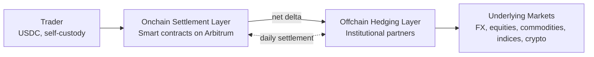

> ## Documentation Index
> Fetch the complete documentation index at: https://docs.ostium.com/llms.txt
> Use this file to discover all available pages before exploring further.

# How Ostium Works

> A comprehensive explanation of the Ostium protocol: the onchain vault, the offchain hedge, how they settle daily, and the three core participants.

Ostium is an onchain perpetual instruments platform offering transparent, non-custodial leverage trading on Stocks, ETFs, Commodities, Indices, Forex, and Crypto with up to 200x leverage. Trades settle instantly in USDC on Arbitrum. Directional flow is hedged offchain through a network of institutional partners — across market makers (like Jump), prime brokers, and other major institutional partners — so pricing on every fill reflects the deepest underlying markets while collateral stays self-custodied onchain.

## What Ostium Does

Ostium operates at the distribution layer of global markets. It offers onchain price exposure to 71 trading pairs across six asset classes and connects directional flow to the deepest underlying liquidity for each asset.

The system has two layers that run side by side:

* **Onchain settlement layer.** USDC collateral is held in audited smart contracts. Positions open, close, and liquidate onchain, and trade PnL settles to the user's wallet instantly. Oracle pricing from Chainlink Low-Latency (crypto) and Stork Network (real-world assets) governs onchain price discovery for opens, closes, and liquidations.
* **Offchain hedging layer.** Directional flow is hedged through a network of institutional partners: market makers (like Jump), prime brokers, and other major institutional partners. Partners supply pricing from the most liquid underlying markets and hedge the resulting flow, so execution on Ostium closely mirrors execution on those markets.

The two layers are reconciled by a **daily settlement run**. Once per day, USDC flows between the onchain vault and the offchain hedging book to rebalance the onchain buffer to its target size:

* If traders net **win** during the day, the vault pays them onchain and the buffer shrinks. At settlement, the offchain book's matching gain is sent onchain to replenish the buffer.
* If traders net **lose** during the day, the vault retains their losses and the buffer grows. At settlement, the excess is sent offchain to keep the hedging book funded.

Between settlements, the protocol is net-flat across the two books. Only the *location* of the USDC changes intraday. Trader collateral remains self-custodied throughout, and every fill remains verifiable onchain.

## Three Pillars: Traders, Liquidity Providers, and Protocol Services

Ostium has three core participants whose interactions make the protocol work. Traders open leveraged positions and pay opening fees. Liquidity providers deposit USDC into OLP and earn yield from those fees, sitting in the senior loss position. Protocol services — oracle pricing, execution automation, settlement infrastructure, and the offchain hedging layer — power execution itself, run permissionlessly across third-party networks.

<CardGroup cols={3}>
  <Card title="Traders" icon="bullseye">
    Open leveraged long or short positions on 71 trading pairs. Pay opening fees, manage TP/SL, settle into self-custodied wallets.
  </Card>

  <Card title="Liquidity Providers" icon="coins">
    Deposit USDC into the OLP vault. Senior loss position, protected by a junior buffer. Earn yield from 30% of opening fees.
  </Card>

  <Card title="Protocol Services" icon="cog">
    Four core services power execution: oracle pricing, automation, settlement infrastructure, and the hedging layer.
  </Card>
</CardGroup>

### Traders

Traders open leveraged long or short positions on any of Ostium's 71 trading pairs. When entering a position, traders pay an opening fee and can set take-profit and stop-loss orders to manage risk. Position size is collateral × leverage; as the asset price moves, unrealized PnL fluctuates in real time. Traders pay rollover fees that reflect real-world carry costs, derived from the futures term structure or funding rates of the underlying asset, plus a carry premium. Either side of a trade can collect rollover rather than pay it, depending on whether the underlying sits in contango or backwardation. Positions are subject to liquidation if collateral falls below the maintenance margin threshold. Traders interact with the protocol entirely onchain; they are never locked into the interface and can exit or manage positions through any contract-enabled wallet.

### Liquidity Providers (LPs)

Liquidity providers deposit USDC into the OLP vault and receive OLP tokens representing a pro-rata claim on vault capital and earned fees. **OLP sits in the senior loss position of the protocol.** A dedicated buffer of junior capital, posted by Ostium affiliates and strategic partners, absorbs trader PnL first, in full, before any loss can reach OLP. This is the same subordination structure used in CLOs and structured credit deals. OLP also functions as the working capital that settles winning trades onchain during the day, with balances restored at daily settlement from the offchain hedge. LPs earn yield from opening fees and can exit by burning OLP, subject to the vault's withdrawal window. See [Vault Overview](/vault/overview) for full deposit mechanics, yield breakdown, and settlement timing.

### Protocol Services

Four core services power execution.

<CardGroup cols={2}>
  <Card title="Oracle Pricing" icon="radio">
    Chainlink Low-Latency oracles supply sub-second crypto prices; Stork Network provides real-world asset prices sourced from traditional-market data feeds. Prices are fetched on-demand when a trader opens a position.
  </Card>

  <Card title="Execution Automation" icon="robot">
    Chainlink Automations and Gelato Functions monitor price levels and execute liquidations, stop-losses, and take-profits in a decentralized, permissionless manner. Neither Ostium Labs nor the protocol controls execution.
  </Card>

  <Card title="Settlement Infrastructure" icon="landmark">
    The OLP vault holds trader collateral, pays winning trades immediately onchain, accrues fees, and enforces maintenance margin. It is not a counterparty to directional flow.
  </Card>

  <Card title="Hedging Layer" icon="shield-check">
    Institutional partners (market makers like Jump, prime brokers, and others) supply pricing from the most liquid underlying markets and hedge the directional flow offchain. The protocol nets internal offsets first; only the residual net delta is hedged.
  </Card>
</CardGroup>

## Protocol, Interface, and Labs

Ostium separates protocol, interface, and team into three distinct components, so users always know which entity they're interacting with. The protocol (audited smart contracts on Arbitrum) is what handles trades and custodies user collateral. The interface (app.ostium.com) is just a frontend and can be replaced. Ostium Labs is the team developing both, but does not custody user funds.

<CardGroup cols={3}>
  <Card title="The Ostium Protocol" icon="code">
    A suite of audited smart contracts deployed on Arbitrum that enable position opening, liquidation, fee accrual, and settlement. Source code is published.
  </Card>

  <Card title="The Ostium Interface" icon="window-maximize">
    The web application at app.ostium.com. The interface is a frontend for interacting with the protocol and can be updated or retired without affecting the underlying contracts.
  </Card>

  <Card title="Ostium Labs" icon="users">
    The team developing the protocol and maintaining the interface. Labs does not custody user funds; collateral stays in audited smart contracts and traders interact with those contracts directly from self-custodied wallets.
  </Card>
</CardGroup>

If the interface goes down, traders can still manage positions via direct contract interaction.

## Why Arbitrum?

Ostium is deployed on Arbitrum because four properties together enable onchain leverage trading without compromising on speed, cost, or security. Sub-second finality lets liquidations execute tightly. Gas fees of approximately \$0.01 per trade keep leverage accessible. Ethereum's security guarantees are inherited through Arbitrum's fraud-proof mechanism. Circle supports USDC natively, simplifying collateral management.

<CardGroup cols={2}>
  <Card title="Sub-second finality" icon="gauge">
    Arbitrum settles transactions in under one second, enabling tight liquidation execution and reliable price discovery.
  </Card>

  <Card title="Ultra-low fees" icon="dollar-sign">
    Network gas costs are approximately \$0.01 per trade, making leveraged trading accessible without prohibitive slippage or fees.
  </Card>

  <Card title="Ethereum security" icon="shield">
    Arbitrum inherits full Ethereum security through validator bonds and the fraud-proof mechanism. Users do not sacrifice decentralization or settlement guarantees.
  </Card>

  <Card title="Native USDC" icon="link">
    Circle supports USDC natively on Arbitrum with full composability, simplifying deposit and collateral management.
  </Card>
</CardGroup>

## Oracle System

Prices are supplied by two oracle networks because crypto and real-world assets need different infrastructure. Both deliver sub-second refresh rates and feed every position open, close, and liquidation onchain.

**Chainlink Low-Latency Oracles** deliver crypto asset prices (Bitcoin, Ethereum, etc.) with sub-second refresh rates. These oracles aggregate prices from onchain DEX liquidity, CEX APIs, and professional price feeds.

**Stork Network** provides prices for real-world assets (forex pairs, commodities, indices, and stocks) by aggregating data from traditional-market data vendors. Prices update on roughly a sub-second basis. Stork is operated independently from Ostium Labs and is decentralized across multiple node operators.

When a trader opens a position, the protocol immediately fetches the current oracle price and uses it as the entry price. If the oracle feed experiences downtime, positions can still be liquidated using the last valid price, preventing vault insolvency.

## Key Statistics

* **\$50B+ cumulative volume** since launch across all 71 trading pairs
* **\$300M+ peak open interest**
* **26K+ traders** globally have opened positions on Ostium
* **71 trading pairs** across six asset classes: Stocks, ETFs, Commodities, Indices, Forex, Crypto
* **Up to 200x leverage** on select pairs, with per-pair caps visible on the [Markets](/traders/reference/markets) page

## FAQ

<AccordionGroup>
  <Accordion title="What happens if the interface goes down?">
    The protocol continues to operate. Traders can still manage positions by calling smart contracts directly from their wallets. Liquidations and automations continue to execute. The interface is not a single point of failure.
  </Accordion>

  <Accordion title="Why perpetual instruments instead of spot trading?">
    Perpetual instruments enable price exposure without owning the underlying asset, and let traders apply leverage without needing to borrow. Spot trading would require the protocol to hold actual assets offchain or mint synthetic tokens, introducing custodial risk. Ostium's perpetual instruments are fully collateralized in USDC, settle instantly onchain, and don't require the protocol to custody anything beyond user collateral.
  </Accordion>

  <Accordion title="Is OLP safe?">
    OLP holds the senior loss position of the protocol. A dedicated buffer of junior capital absorbs trader PnL first, in full, before any loss can reach OLP. This is the same subordination structure used in CLOs and structured credit deals. The vault holds USDC in audited smart contracts, reviewed by three independent security firms (Zellic, ThreeSigma, Pashov). OLP deposits are not insured. See [Vault Overview](/vault/overview).
  </Accordion>

  <Accordion title="Why does the USDC in the vault move around intraday?">
    The vault is the instant-settlement layer for every trade on Ostium. When traders close winning positions, the vault pays them immediately onchain, and those flows are mirrored by offchain hedges so the protocol stays balanced. Only the *location* of the USDC changes intraday. Once per day, a settlement run moves USDC between the two books to restore the buffer to its target size. This is operational cash flow, not loss.
  </Accordion>

  <Accordion title="How does Ostium source liquidity?">
    Trades settle instantly onchain through the OLP vault. Directional flow is hedged offchain through a network of institutional partners, across market makers (like Jump), prime brokers, and other major institutional partners. These partners supply pricing from the most liquid underlying markets, so fills on Ostium closely mirror the underlying exchange.
  </Accordion>

  <Accordion title="Does one trader's position affect another trader's PnL?">
    No. Because directional flow is hedged offchain through institutional partners, no individual trader's PnL depends on the positioning of any other trader on Ostium. If a large cohort is long oil, that does not alter the cost or payoff of another long-oil position.
  </Accordion>

  <Accordion title="Does Ostium run an order book?">
    No. Ostium uses request-for-quote (RFQ) — the protocol solicits a live quote from its institutional partner network for each order, rather than matching against resting orders in a book. This is what lets Ostium inherit the depth of the underlying venues instead of rebuilding liquidity for each asset from scratch.
  </Accordion>
</AccordionGroup>

## What to Read Next

<CardGroup cols={3}>
  <Card title="Smart Contract Audits" icon="shield-check" href="/protocol/security/audits">
    Detailed audit summaries and contract verification.
  </Card>

  <Card title="Vault Overview" icon="landmark" href="/vault/overview">
    How the OLP settlement layer manages collateral and fees.
  </Card>

  <Card title="Markets" icon="list" href="/traders/reference/markets">
    Full list of trading pairs and asset classes.
  </Card>
</CardGroup>
