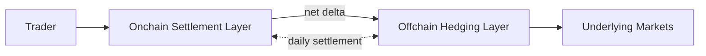

> ## Documentation Index
> Fetch the complete documentation index at: https://docs.ostium.com/llms.txt
> Use this file to discover all available pages before exploring further.

# Welcome to Ostium

> What Ostium is, how it works, and where to start trading.

Ostium is the onchain gateway to the world's most liquid global markets. It offers perpetual-instrument exposure to 71 trading pairs across Stocks, ETFs, Commodities, Indices, Forex, and Crypto, with up to 200x leverage, instant settlement in USDC, self-custody, and full transparency on every fill.

## What Ostium Is

Ostium operates at the distribution layer of global markets. It consolidates global demand into a single transparent, onchain venue and connects flow to the deepest underlying liquidity for each asset. Traders deposit USDC, open leveraged long or short positions, and settle directly into their own wallet.

The protocol is purpose-built to complement existing exchange and data infrastructure rather than replace it. Every fill is quoted against the most liquid sources for a given pair, so execution on Ostium closely mirrors execution on the underlying market.

<Note>
  **Ostium aims to be for global markets what stablecoins are for the dollar.** Stablecoins did not replace the dollar — they extended its reach to millions of new users, generating entirely new demand for dollar-denominated assets. Ostium does the same for the world's most liquid markets.
</Note>

## How It Works

Trades settle instantly onchain in USDC through a dedicated settlement layer, the liquidity pool vault. Directional flow is hedged off-chain through a network of institutional partners, across market makers (like Jump), prime brokers, and other major institutional partners. These partners supply pricing from the deepest underlying markets, while trader collateral remains self-custodied in segregated smart contracts and every fill remains verifiable onchain.

For the full protocol architecture, including the settlement infrastructure and oracle system, see [How Ostium Works](/protocol/how-ostium-works).

## What You Get as a Trader

Every position you open on Ostium benefits from five structural properties that together preserve self-custody while delivering institutional-grade execution: collateral stays in segregated smart contracts, settlement is instant in USDC, every fill is verifiable onchain, liquidity scales with the depth of the underlying market, and you can manage positions through any contract-enabled wallet without depending on the Ostium interface.

<CardGroup cols={2}>
  <Card title="Self-custody at all times" icon="lock">
    Collateral lives in segregated smart contracts. Ostium cannot access or move your funds.
  </Card>

  <Card title="Instant settlement" icon="zap">
    When you close a position, USDC moves directly to your wallet. There is no multi-day settlement delay.
  </Card>

  <Card title="Full transparency" icon="eye">
    Every historical fill is viewable onchain, and every price used to fill a trade is publicly auditable.
  </Card>

  <Card title="Deep, dynamic liquidity" icon="layers">
    Liquidity scales with the depth of the underlying markets, not with a fixed onchain pool. Slippage on large orders reflects venue depth, and execution closely mirrors the underlying exchange.
  </Card>

  <Card title="Direct protocol access" icon="terminal">
    You can manage your own positions through any wallet that can sign Ostium contract calls, not just the Ostium interface. You're never locked into a single frontend.
  </Card>
</CardGroup>

## At a Glance

Ostium has processed over \$50B in cumulative trading volume across 800K+ trades from 26K+ unique traders, supporting 71 perpetual instrument pairs across six asset classes — Stocks, ETFs, Commodities, Indices, Forex, and Crypto. The protocol is deployed on Arbitrum, settles in USDC, and supports up to 200x leverage on select pairs.

<CardGroup cols={4}>
  <Card title="$50B+" icon="chart-line">
    Cumulative volume
  </Card>

  <Card title="800K+" icon="arrow-right-arrow-left">
    Total trades
  </Card>

  <Card title="26K+" icon="users">
    Traders
  </Card>

  <Card title="71" icon="layer-group">
    Trading pairs
  </Card>
</CardGroup>

## FAQ

<AccordionGroup>
  <Accordion title="Who can use Ostium?">
    Anyone with a compatible wallet and USDC on Arbitrum can trade on Ostium. The protocol is non-custodial, meaning you retain control of your funds at all times. Regional eligibility and restrictions are governed by the [Terms of Use](/legal/terms-of-use).
  </Accordion>

  <Accordion title="How does Ostium source liquidity?">
    Trades settle instantly onchain through Ostium's onchain settlement layer. Directional flow is hedged offchain through a network of institutional partners, across market makers (like Jump), prime brokers, and other major institutional partners. These partners provide pricing from the most liquid underlying markets, so fills on Ostium closely mirror the underlying exchange.
  </Accordion>

  <Accordion title="What assets can I trade?">
    Ostium offers 71 perpetual instrument trading pairs across six asset classes: Stocks, ETFs, Commodities, Indices, Forex, and Crypto. Leverage goes up to 200x on select assets. The full list with per-pair leverage caps and market hours is on the [Markets](/traders/reference/markets) page.
  </Accordion>
</AccordionGroup>

<Note>
  **Building on Ostium?** The Builder SDK gives you programmatic access to trading, market data, and positions. Start at the [Developer Documentation](/developer/sdk/overview).
</Note>

## What to Read Next

<CardGroup cols={3}>
  <Card title="Connect Your Account" icon="wallet" href="/traders/getting-started/connect-account">
    Set up a wallet and fund it with USDC.
  </Card>

  <Card title="Opening a Trade" icon="arrow-up-right" href="/traders/trading/opening-a-trade">
    Walk through your first position from collateral to close.
  </Card>

  <Card title="How Ostium Works" icon="compass" href="/protocol/how-ostium-works">
    Two-layer architecture, settlement and hedging, oracle system, and the four core services that run the protocol.
  </Card>
</CardGroup>
