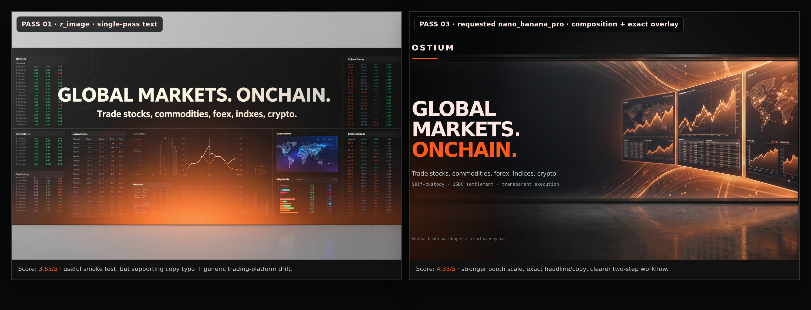
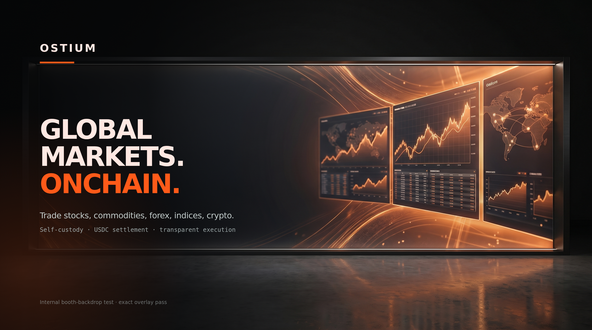

# Higgsfield MCP case study

This case study shows how the Ostium brand system can move beyond deterministic SVG templates into richer image-generation workflows while staying anchored to `brand.md`.

The work started with a simple question: can an agent use the source-backed Ostium spec to create a new asset type, judge the output, and improve it without turning the process into a one-off prompt trick?

## Setup

The agent used:

- `brands/ostium/brand.md` as the creative control layer;
- `brands/ostium/source-inventory.md`, provenance, and traceability docs for source discipline;
- Higgsfield MCP for image generation;
- local review packets for scoring and comparison;
- deterministic HTML overlays for exact typography and copy.

The static-image passes focused on two unsupported formats:

1. a conference booth backdrop;
2. a research/report cover or website-hero style composition.

## Pass 1: conference booth backdrop

The first live Higgsfield run used `z_image` and generated a conference booth backdrop from the Ostium prompt packet.

Result:

- The output captured some of the dark/orange institutional market feel.
- It also rendered a typo in the supporting copy: `foex` instead of `forex`.
- The product direction felt too generic in places.

This was still useful. The result made the workflow better because it exposed the wrong responsibility split. The image model should carry atmosphere, composition, booth scale, lighting, and market mood. It should not be trusted with final copy, logo geometry, data values, or claim-sensitive product text.

Review score: `3.65/5`.

## Pass 2: research/report cover

The next pass requested `nano_banana_pro` and used a composition-only prompt. The generated layer focused on atmosphere, product environment, and negative space. Exact headline and supporting copy were added later through a deterministic overlay.

Result:

- stronger Ostium feel;
- cleaner product/market specificity;
- exact overlaid typography;
- better separation between generative composition and source-controlled copy.

Review score: `4.4/5`.

## Pass 3: booth rerun

The original booth concept was rerun using the two-step workflow.

The new process:

1. generate only the physical booth environment and composition;
2. reserve safe areas for text;
3. overlay the headline, supporting line, and proof line deterministically;
4. compare the result against the first generation.

The side-by-side comparison showed the value of the loop. The second booth pass kept the useful visual direction from the first run, removed the text-rendering failure, improved physical booth scale, and made the brand/product hierarchy clearer.

Review score: `4.35/5`.

Comparison artifact:



Final rerun composite:



## Workflow lesson

The strongest pattern was not "write a better prompt." It was a repeatable agent loop:

```text
brand spec -> prompt packet -> generation -> review -> failure classification -> targeted rerun -> comparison packet
```

The loop produced a practical production rule:

```text
generative model = composition, atmosphere, market mood, booth/report/video direction
deterministic or text-accurate pass = exact copy, logo, product UI, numbers, claims
```

That split makes the workflow more useful for campaign prototyping. An agent can try directions quickly without losing control of the parts that need to stay exact.

## Where this goes next

The same loop can be applied to:

- app-store or product screenshot concepts with source-approved UI overlays;
- launch campaign visual directions;
- market-event videos;
- founder/operator narrative hook testing;
- Seedance 2.0 video generation followed by Higgsfield Virality Predictor feedback.

For video, the repo now defines the intended loop:

```text
video brief -> Seedance 2.0 generation -> brand/video review -> Virality Predictor -> prompt/storyboard revision -> bounded rerun
```

That lets a team test hooks and campaign framing before a shoot, while keeping the work tied to Ostium's brand, product, and source constraints.
